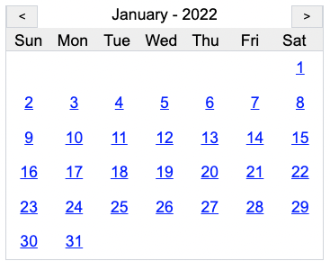

# Baby Calendar
A tiny, baby, useless (almost) calendar widget in Vanilla JS.



## Example

```html
<!DOCTYPE html>
<html lang="en">
  <head>
    <meta charset="UTF-8" />
    <title>Example Using Baby Calendar</title>

    <link
      type="text/css"
      rel="stylesheet"
      media="screen"
      href="babycalendar.css"
    />

    <style type="text/css">
      body {
        font-family: Arial, Helvetica, sans-serif;
        font-size: 1.1em;
      }
    </style>
  </head>
  <body>
    <main id="example">
      <baby-calendar
        id="calendar"
        month="0"
        year="2022"
        shownavigation="true"
      ></baby-calendar>

      <button id="today">Today</button>
    </main>
  </body>

  <script src="babycalendar.js" type="module"></script>
  <script type="module">
    let today = document.getElementById("today");
    let calendar = document.getElementById("calendar");

    calendar.eventDates = [
      "2022-01-14",
      "2022-01-22",
      "2022-02-10",
    ];

    /*
     * Listen for today click
     */
    today.addEventListener("click", () => {
      calendar.today();
    });

    /*
     * When the month is changed, write the information to console
     */
    calendar.addEventListener("babycalendar-changemonth", (e) => {
      let info = e.detail;
      console.log(info);
    });

    /*
     * When a day is selected, write the information to console.
     */
    calendar.addEventListener("babycalendar-dayselected", (e) => {
      let info = e.detail;
      console.log(info);
    });
  </script>
</html>
```

## Usage

Baby Calendar is a custom web component which is supported in all current major browsers. To use it, simply include the CSS and JS files, then drop a `<baby-calendar></baby-calendar>` node into your markup. Or, if you wish, you can inject it via JavaScript like so.

```javascript
let calendar = document.createElement("baby-calendar");
calendar.setAttribute("month", 0);
calendar.setAttribute("year", 2022);
calendar.setAttribute("shownavigation", true);

document.getElementById("example").insertAdjacentElement("afterbegin", calendar);
```

### Attributes

* **month** - 0-based month. Defaults to 0 (January)
* **year** - 4-digit year
* **shownavigation** - *true* to display the month navigation. Defaults to *false*
* **eventDates** - An array of date strings, each in the format of YYYY-MM-DD

### Methods

* **nextMonth()** - Advances the calendar to the next month
* **previousMonth()** - Move the calendar back one month
* **redraw()** - Re-draws the calendar
* **today()** - Sets the calendar to today's month and year

### Events

Baby Calendar emits several events, allowing you to take custom actions when certain things happen in the calendar.

#### Change Month

When the month in the calendar is change using the navigation, or by calling **nextMonth()** or **previousMonth()**, the event `babycalendar-changemonth` is emitted. It is a [CustomEvent](https://developer.mozilla.org/en-US/docs/Web/API/CustomEvent/CustomEvent), so the **detail** key will contain an object with the following information.

```json
{
  month: <number>,
  year: <number>
}
```

For example:

```javascript
calendar.addEventListener("babycalendar-changemonth", (e) => {
  let info = e.detail;
  console.log(info);
});
```

#### Day Selected

When a day or day cell is clicked in the calendar, the event `babycalendar-dayselected` is emitted. It is a [CustomEvent](https://developer.mozilla.org/en-US/docs/Web/API/CustomEvent/CustomEvent), so the **detail** key will contain an object with the following information.

```json
{
  month: <number>,
  year: <number>,
  day: <number>
}
```

For example:

```javascript
calendar.addEventListener("babycalendar-dayselected", (e) => {
  let info = e.detail;
  console.log(info);
});
```

## Event Dates

Baby Calendar has the ability to highlight days that have one or more events. To do this set the **eventDates** property to an array of date strings. Each string in the array must be formatted liked **YYYY-MM-DD** for a match to happen.

So, given the following array:

```javascript
calendar.eventDates = [
  "2022-01-14",
  "2022-01-22",
  "2022-02-10",
];
```

The day cells of the *Jan 14th*, *Jan 22nd*, and *Feb 10th* of 2022 would have a background color highlight. 

## Styling

Baby Calendar is easily styled. The markup generated uses basic DIVs and a CSS grid display. All parts of the calendar, the body, header, navigation, buttons, and days, all have classes associated to them. Each item has a color variable as well.

* **--babycalendar-border-color** - Used for borders. Default is rgb(206, 212, 218)
* **--babycalendar-header-background-color** - Used for the background of the header (where the days are). Default is #eee
* **--babycalendar-event-background-hover-color** - Used to control the background color of days when hovered over. Default is #eee
* **--babycalendar-day-color** - Controls the color of the day numbers. Default is blue
* **--babycalendar-day-background-color** - Controls the color of the background for days when there are events present. Default is #33D1FF

## License

MIT License

Copyright (c) 2022 App Nerds

Permission is hereby granted, free of charge, to any person obtaining a copy
of this software and associated documentation files (the "Software"), to deal
in the Software without restriction, including without limitation the rights
to use, copy, modify, merge, publish, distribute, sublicense, and/or sell
copies of the Software, and to permit persons to whom the Software is
furnished to do so, subject to the following conditions:

The above copyright notice and this permission notice shall be included in all
copies or substantial portions of the Software.

THE SOFTWARE IS PROVIDED "AS IS", WITHOUT WARRANTY OF ANY KIND, EXPRESS OR
IMPLIED, INCLUDING BUT NOT LIMITED TO THE WARRANTIES OF MERCHANTABILITY,
FITNESS FOR A PARTICULAR PURPOSE AND NONINFRINGEMENT. IN NO EVENT SHALL THE
AUTHORS OR COPYRIGHT HOLDERS BE LIABLE FOR ANY CLAIM, DAMAGES OR OTHER
LIABILITY, WHETHER IN AN ACTION OF CONTRACT, TORT OR OTHERWISE, ARISING FROM,
OUT OF OR IN CONNECTION WITH THE SOFTWARE OR THE USE OR OTHER DEALINGS IN THE
SOFTWARE.

